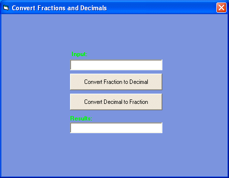

## Convert from fractions to decimal and back

### Description

This code will convert a Fraction to a decimal, and also convert a decimal to the lowest common denominator. It has now been updated to handle repeating decimals.
 
### More Info
 
A string consisting of a fraction or decdimal

Returns either a fraction or decimal depending on the users choice.

             |
---                |---
**Submitted On**   |2002-02-26 13:02:44
**By**             |[John Tunmire](https://github.com/Planet-Source-Code/PSCIndex/blob/master/ByAuthor/john-tunmire.md)
**Level**          |Advanced
**User Rating**    |4.3 (13 globes from 3 users)
**Compatibility**  |VB 6\.0
**Category**       |[Math/ Dates](https://github.com/Planet-Source-Code/PSCIndex/blob/master/ByCategory/math-dates__1-37.md)
**World**          |[Visual Basic](https://github.com/Planet-Source-Code/PSCIndex/blob/master/ByWorld/visual-basic.md)
**Archive File**   |[Convert\_fr577852262002\.zip](https://github.com/Planet-Source-Code/john-tunmire-convert-from-fractions-to-decimal-and-back__1-32118/archive/master.zip)

